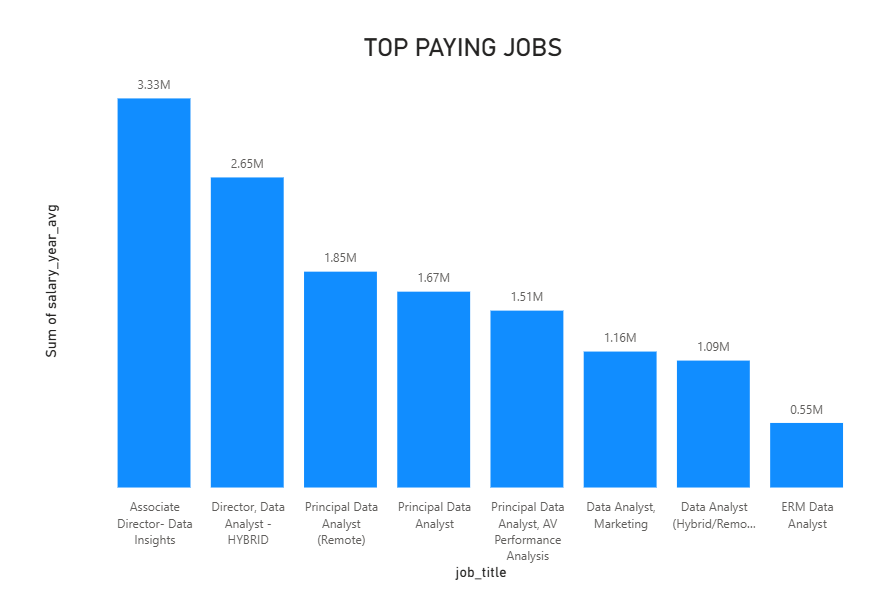
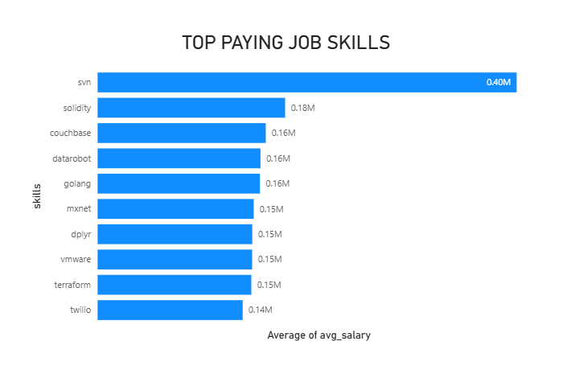
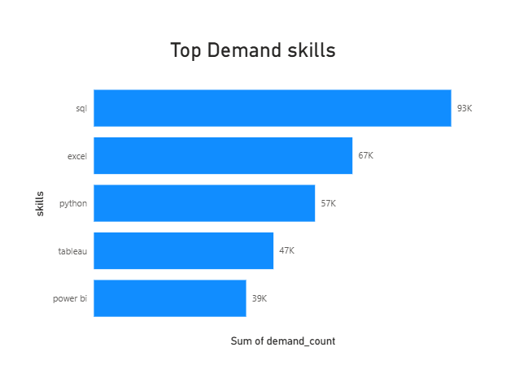
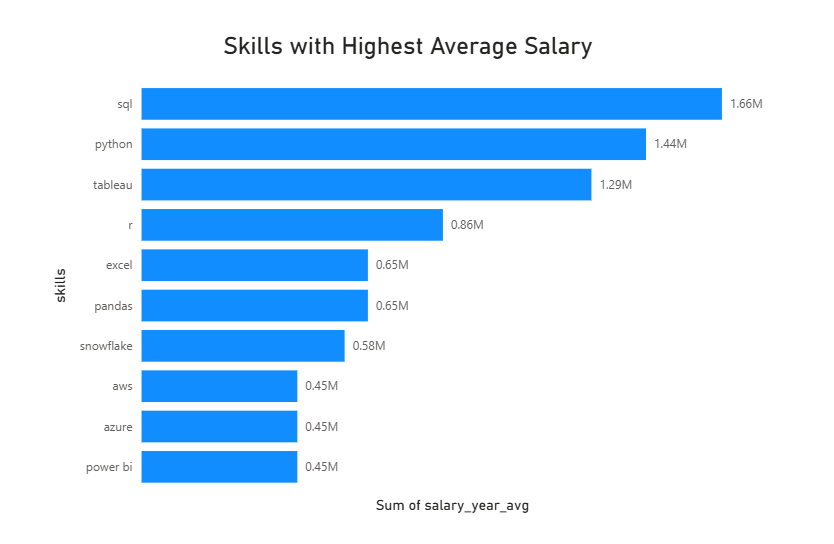
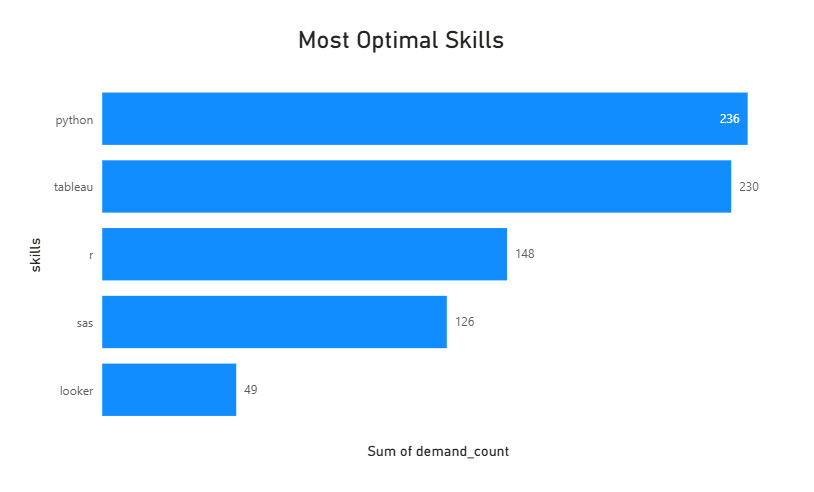

# 📊 Job Market Insights with SQL

---

## 📝 Introduction

This project dives into the **data analytics job market**, aiming to uncover key insights such as the **top-paying roles**, **most in-demand and high-paying skills**, and **optimal skills** that offer the best balance between demand and compensation. SQL was used as the primary tool for querying a structured database of job postings, skills, and companies to guide professionals and learners in making informed career decisions.

---

## 📚 Background

With the rising demand for data professionals, understanding the landscape of job roles and skill requirements has become critical. By analyzing a dataset of job postings, this project explores which skills lead to higher salaries, which ones are most requested, and where they intersect to form the most **strategically valuable skills**.

---

## 🛠️ Tools Used

- **SQL** (PostgreSQL): Core language for data querying  
- **VS Code**: Development environment  
- **CSV Files**: Raw data source for jobs, companies, and skills  
- **Git**: Version control  

---

## 📈 The Analysis

All analysis was done through SQL queries available in the `/project_sql/` folder. Key queries include:

1. **Top Paying Jobs**  
   → Identifies the highest paying roles in the data job market.

```   sql
SELECT 
    job_id,
    job_title,
    job_location,
    job_schedule_type,
    salary_year_avg,
    job_posted_date,
    company_dim.name as company_name
FROM
    job_postings_fact
join 
    company_dim ON job_postings_fact.company_id = company_dim.company_id
WHERE
    job_title_short = 'Data Analyst' AND 
    job_location = 'Anywhere' AND
    salary_year_avg IS NOT NULL
ORDER BY
    salary_year_avg DESC
LIMIT 10
```



2. **Top Paying Job Skills**  
   → Skills that are commonly associated with high-salary jobs.

```SQL
WITH top_paying_jobs AS( 
    SELECT 
        job_postings_fact.job_id,
        job_title,
        job_location,
        job_schedule_type,
        salary_year_avg,
        job_posted_date,
        company_dim.name as company_name
    FROM
        job_postings_fact
    LEFT JOIN 
        company_dim ON job_postings_fact.company_id = company_dim.company_id
    WHERE
        job_title_short = 'Data Analyst' AND 
        job_location = 'Anywhere' AND
        salary_year_avg IS NOT NULL
    ORDER BY
        salary_year_avg DESC
    LIMIT 10
)
SELECT
     top_paying_jobs.*,
     skills
FROM
    top_paying_jobs
JOIN 
    skills_job_dim ON top_paying_jobs.job_id = skills_job_dim.job_id
JOIN
    skills_dim ON skills_job_dim.skill_id = skills_dim.skill_id
ORDER BY
    salary_year_avg DESC
```


3. **Most Demanded Skills**  
   → Skills that appear most frequently across job postings.
```SQL
SELECT 
    skills,
    count(job_postings_fact.job_id) as demand_count
FROM
     job_postings_fact
JOIN 
    skills_job_dim ON job_postings_fact.job_id = skills_job_dim.job_id
JOIN
    skills_dim ON skills_job_dim.skill_id = skills_dim.skill_id
WHERE
    job_title_short = 'Data Analyst'
GROUP BY
    skills
ORDER BY
    demand_count DESC
LIMIT 5
```


4. **Skills with Highest Average Salary**  
   → Analyzes average salary associated with each skill.
```SQL
SELECT 
    skills,
    round(AVG(salary_year_avg), 2) AS avg_salary
FROM
     job_postings_fact
JOIN 
    skills_job_dim ON job_postings_fact.job_id = skills_job_dim.job_id
JOIN
    skills_dim ON skills_job_dim.skill_id = skills_dim.skill_id
WHERE
    job_title_short = 'Data Analyst' AND
    salary_year_avg is NOT NULL
GROUP BY
    skills
ORDER BY
    avg_salary DESC
LIMIT 25
```


5. **Most Optimal Skills**  
   → Skills that have both high demand and competitive salary potential.
```SQL
WITH skill_demand AS ( 
    SELECT 
        skills_dim.skills,
        skills_job_dim.skill_id,
        COUNT(job_postings_fact.job_id) AS demand_count
    FROM
        job_postings_fact
    JOIN 
        skills_job_dim ON job_postings_fact.job_id = skills_job_dim.job_id
    JOIN
        skills_dim ON skills_job_dim.skill_id = skills_dim.skill_id
    WHERE
        job_title_short = 'Data Analyst' AND
        salary_year_avg is NOT NULL AND
        job_work_from_home = 'true'
    GROUP BY
        skills_job_dim.skill_id, skills_dim.skills
), 
average_salary AS ( 
    SELECT 
        skills_dim.skills,
        skills_job_dim.skill_id,
        ROUND(AVG(salary_year_avg), 2) AS avg_salary
    FROM
        job_postings_fact
    JOIN 
        skills_job_dim ON job_postings_fact.job_id = skills_job_dim.job_id
    JOIN
        skills_dim ON skills_job_dim.skill_id = skills_dim.skill_id
    WHERE
        job_title_short = 'Data Analyst' AND
        salary_year_avg IS NOT NULL AND
        job_work_from_home = 'true'
    GROUP BY
        skills_job_dim.skill_id, skills_dim.skills
)
SELECT
    skill_demand.skill_id,
    skill_demand.skills,
    skill_demand.demand_count,
    average_salary.avg_salary
FROM
    skill_demand
JOIN 
    average_salary ON skill_demand.skill_id = average_salary.skill_id
WHERE
    demand_count > 10
ORDER by  
    avg_salary DESC,
    demand_count DESC
LIMIT 25
```
or
```SQL
/-- can also be done in smaller query

SELECT skills_dim.skill_id,
    skills_dim.skills,
    count(job_postings_fact.job_id) AS demand_count,
    round(AVG(salary_year_avg), 2) AS avg_salary
from
     job_postings_fact
join 
    skills_job_dim on job_postings_fact.job_id = skills_job_dim.job_id
join 
    skills_dim on skills_job_dim.skill_id = skills_dim.skill_id
WHERE
    job_title_short = 'Data Analyst' and
    salary_year_avg is not NULL and 
    job_work_from_home ='true'
GROUP by
    skills_dim.skill_id, 
    skills_dim.skills
having
    count(job_postings_fact.job_id)> 10
ORDER by 
    avg_salary DESC,
    demand_count DESC
LIMIT 25;
```


You can view and run all these SQL files from the [`project_sql`](./project_sql) folder.

---

## 📘 What I Learned

### 🔹 1. Advanced SQL Querying
I strengthened my SQL skills through complex, real-world queries involving:
- Multi-table **JOINs** (including fact and dimension tables)
- Use of **aggregate functions** like `AVG()`, `COUNT()`, and `SUM()` to derive insights
- Applying **subqueries** to filter and rank skills by salary and demand
- Leveraging **CTEs (Common Table Expressions)** for modular and readable queries

### 🔹 2. Data-Driven Decision Making
By translating raw job posting data into actionable insights, I learned how to:
- Identify **high-value skills** that offer a strong return on investment for learners
- Understand how **demand and salary trends** can guide career paths
- Use metrics like **average salary per skill** and **demand-to-salary ratio** to assess skill competitiveness

### 🔹 3. Dimensional Modeling and Schema Understanding
The project helped me understand how to:
- Work with **star schema** structures using dimension and fact tables
- Efficiently link datasets like `skills_dim`, `job_postings_fact`, and `company_dim` using foreign keys
- Normalize data for analytical querying

### 🔹 4. Project Organization and Query Modularity
I practiced:
- Organizing SQL queries by objective (e.g., top-paying jobs, in-demand skills)
- Writing **modular SQL scripts** that can be reused or adapted for similar datasets
- Maintaining a clean project structure with separate folders for SQL logic and data

### 🔹 5. Job Market Insight
On a domain level, I gained a deeper understanding of:
- The **most lucrative roles** in data analytics
- Which **skills are most valued** in the current job market
- How to identify **optimal skill combinations** that maximize job opportunities and compensation

---

## ✅ Conclusion

This project highlights the immense value of SQL in conducting meaningful job market analysis. The insights generated help identify the most rewarding paths for aspiring data professionals and inform decision-making for upskilling or hiring strategies. Future extensions of the project could involve visualizing the results using BI tools or integrating more datasets like job location and industry segmentation.

